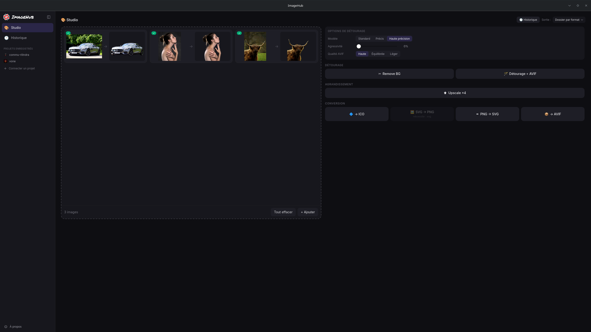
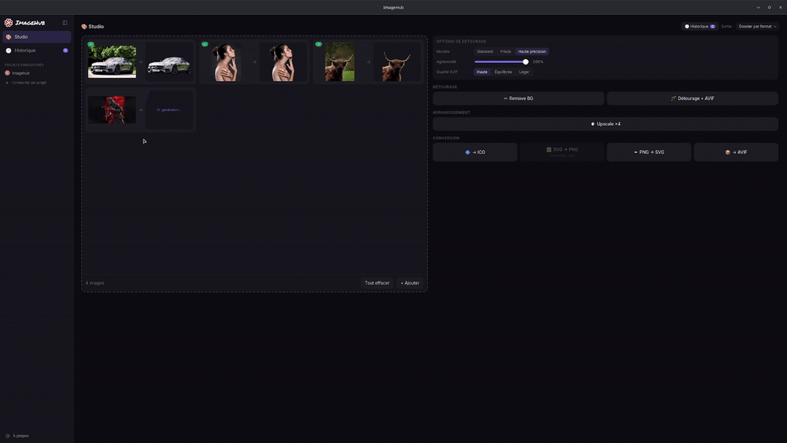
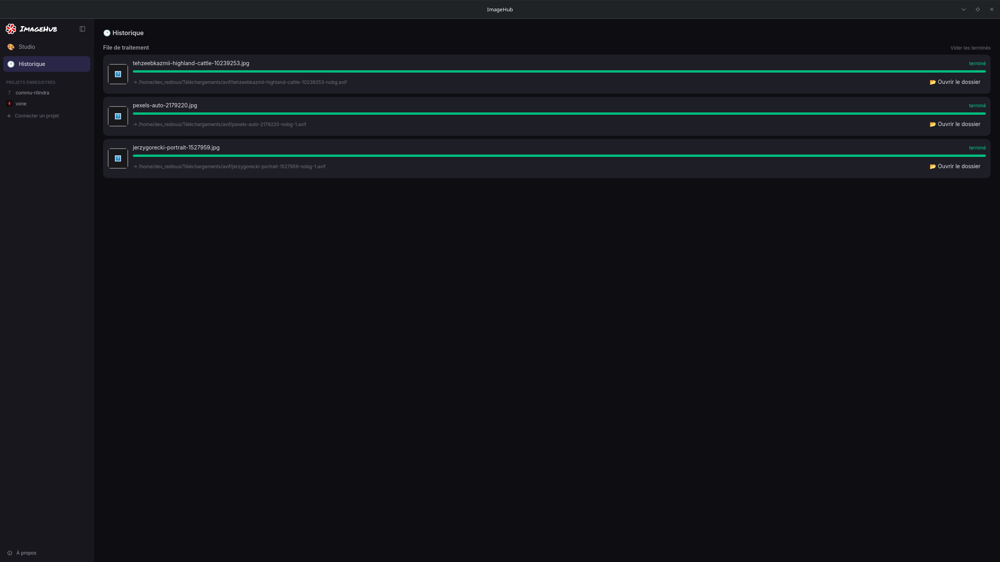
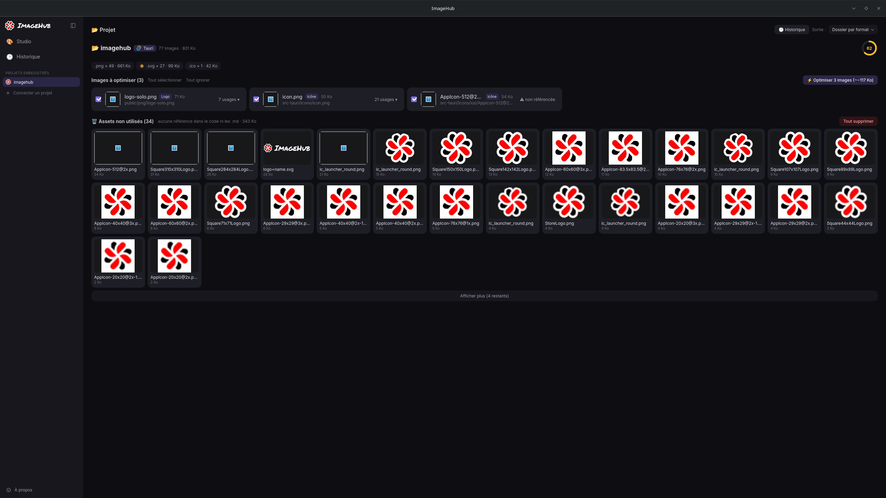
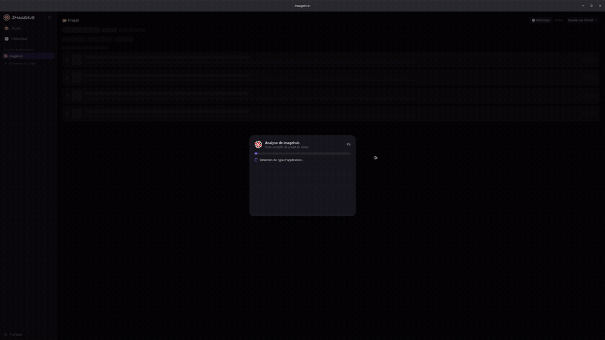

<div align="center">
  

  <p align="center">
    
    
    
    
    
    
    
  </p>

  <p align="center">
    
    
    
    
    
    
  </p>

  <p align="center">
    <i>Traitement &amp; optimisation d'images en local, gratuit et sans abonnement — + audit des assets de tes projets de dev.</i><br>
    Dépôt  <a href="https://github.com/DevRedious/imagehub">DevRedious/imagehub</a>
  </p>
</div>

---

**ImageHub** est une application de bureau (Tauri 2) de traitement et d'optimisation d'images, **100 % locale** : rien ne part sur Internet, aucun abonnement, aucune dépendance à un service d'IA en ligne. Deux usages complémentaires :

- **Studio** — convertir / transformer des images à la demande (upscale, détourage, conversions, packs d'icônes) en déléguant à des outils CLI installés sur la machine. Chaque image déposée s'anime façon « génération IA » : scan de l'original puis révélation du résultat en **avant → après**.
- **Projet** — connecter un dépôt de code, inventorier ses images, repérer les fichiers lourds et les assets inutilisés, optimiser en AVIF en lot, puis générer un prompt d'intégration pour un agent IA.

> ImageHub ne contient **pas** de moteur d'IA embarqué. Les modèles (détourage, upscale) sont des outils **externes** que tu installes une fois, et tournent en local sur ton CPU/GPU. L'« IA » de la partie Projet se limite à des **prompts d'intégration** copiés dans le presse-papier (à coller à un agent type Claude / Cursor).

## Aperçu

<!-- MEDIA: captures et démos — voir docs/media/CAPTURE.md pour le plan de tournage -->

| Studio (dépôt + actions) | Animation avant → après |
| --- | --- |
|  |  |

| Historique des traitements | Audit d'un projet connecté |
| --- | --- |
|  |  |

> _Démo d'ajout de projet (scan) :_ 

## Fonctionnalités

### Studio — actions sur fichiers

Glisse tes images dans la **grande zone de dépôt** (qui affiche la vraie image, pas une vignette) : chaque fichier devient une tuile. Au lancement d'une action, la tuile s'élargit en carte **avant → après** et joue une animation (scan de l'original → « génération » → révélation du résultat par balayage), synchronisée au traitement réel. Le résultat **reste affiché** ; un clic l'ouvre en grand, avec un bouton **« 📂 Ouvrir le dossier »**.

Les **10 actions** sont regroupées par catégorie et **filtrées selon le type de fichier** présent (catégorie sans action applicable masquée, action incompatible grisée avec sa raison, message éphémère en cas d'incompatibilité) :

| Catégorie | Action | Moteur | Entrées |
| --- | --- | --- | --- |
| **Détourage** | Remove BG | rembg | png/jpg/webp |
| | Détourage + AVIF | rembg + avifenc | png/jpg/webp |
| **Agrandissement** | Upscale ×4 | Real-ESRGAN (GPU) | png/jpg/webp/avif |
| **Conversion** | → AVIF | ffmpeg | toutes |
| | → ICO | ImageMagick | toutes |
| | PNG → SVG | vtracer | png/jpg |
| | SVG → PNG | Inkscape | svg |
| **Packs d'icônes** | Icônes Web / Appli / Desktop | ImageMagick + Inkscape | svg |

- **Détourage réglable** : choix du **modèle** (Standard `u2net` · Précis `isnet` · Haute précision `birefnet`) et **agressivité** (préserve plus ou moins les détails fins) — partagés par Remove BG et Détourage + AVIF.
- **Détourage + AVIF** conserve la **transparence** via `avifenc` (jamais ffmpeg, qui perd silencieusement l'alpha sur certains builds) ; presets de qualité **Haute/Équilibrée/Léger**, alpha vérifié après encodage.
- **Packs d'icônes** : depuis un SVG, génèrent un pack complet (favicon/PWA, iOS/Android/Expo, ou Tauri/Electron). Le ratio du logo est préservé (centré, jamais déformé) et les icônes **maskable** reçoivent un fond plein adapté. Si le logo contient du blanc ou du noir, les variantes **dark et light** sont générées automatiquement (seul l'achromatique est inversé, les couleurs sont préservées). Quand un projet est connecté, les fichiers sont écrits aux emplacements conventionnels (`public/`, `assets/`, `src-tauri/icons/`) et un **prompt d'intégration** adapté à la stack est copié dans le presse-papier.
- **Historique** dédié : file des traitements (en cours / terminés), aperçu du résultat et **ouverture directe du dossier de sortie** (fichier sélectionné). Un badge signale les traitements en cours.
- **Sortie configurable** (à côté de l'original, sous-dossier par format, ou dossier choisi), collisions de noms évitées par suffixe `-1`, `-2`, …

### Projet connecté — analyse et optimisation

- **Détection de stack** : tauri, expo, react-native, nextjs, electron, android, nuxt, angular, astro, svelte, vue, vite, rust, python, node, generic — avec détection de l'**icône réelle** de l'app.
- **Inventaire des images** (par extension, poids) et repérage des **fichiers lourds** (PNG/JPG ≥ 50 Ko, candidats AVIF), en ignorant `node_modules`, `dist`, `target`, etc.
- **Scan chirurgical des usages** : recherche de chaque image dans tout le code (js/ts/vue/svelte/astro/html/css/rust/py/xml/plist/gradle…), rôle inféré (logo, favicon, bannière…) et références `fichier:ligne`.
- **Détection des assets inutilisés** (aucune référence) + suppression confirmée.
- **Score qualité 0–100** pondéré par le poids non optimisé, le nombre d'images lourdes et les assets morts.
- **Optimisation AVIF en lot** des fichiers lourds, suivie d'un prompt listant les conversions et les références exactes à corriger.
- **Surveillance temps réel** (`notify`, débounce 1 s) : ré-analyse silencieuse à chaque changement, repli manuel « Réanalyser » si le watcher est indisponible.

## Installation

### 1. L'application

Télécharge le binaire correspondant à ton OS depuis la page **[Releases](https://github.com/DevRedious/imagehub/releases)** :

| OS | Fichier | Notes |
| --- | --- | --- |
| **Linux** | `*.AppImage` | Recommandé — bénéficie des **mises à jour automatiques** (rends-le exécutable : `chmod +x *.AppImage`) |
| **Linux** | `*.deb` / `*.rpm` | Installation via le gestionnaire de paquets (mises à jour manuelles) |
| **Windows** | `*_x64-setup.exe` | Installeur NSIS ; ffmpeg, Real-ESRGAN (+ modèles) et vtracer sont **embarqués** |

### 2. Les moteurs externes

Les actions délèguent à des outils CLI résolus dynamiquement (**sidecar bundlé → `~/.local/bin` → `PATH`**). Installe seulement ceux dont tu as besoin : la commande interne `check_tools` détecte leur présence et **grise** les actions dont le moteur manque (rien ne plante).

| Moteur | Sert à | Fedora / Nobara | Debian / Ubuntu | Arch | Windows |
| --- | --- | --- | --- | --- | --- |
| **ffmpeg** | → AVIF, pré-conv. upscale | `dnf install ffmpeg` | `apt install ffmpeg` | `pacman -S ffmpeg` | bundlé / `winget install ffmpeg` |
| **ImageMagick** (`magick`) | → ICO, packs d'icônes | `dnf install ImageMagick` | `apt install imagemagick` | `pacman -S imagemagick` | `winget install ImageMagick` |
| **Inkscape** | SVG → PNG, packs d'icônes | `dnf install inkscape` | `apt install inkscape` | `pacman -S inkscape` | `winget install Inkscape` |
| **libavif-tools** (`avifenc`/`avifdec`) | AVIF transparent | `dnf install libavif-tools` | `apt install libavif-bin` | `pacman -S libavif` | [libavif releases](https://github.com/AOMediaCodec/libavif/releases) |
| **vtracer** | PNG/JPG → SVG | `cargo install vtracer` | `cargo install vtracer` | `cargo install vtracer` | bundlé |
| **Real-ESRGAN** | Upscale ×4 (GPU Vulkan) | voir ci-dessous | voir ci-dessous | voir ci-dessous | bundlé |
| **rembg** | Détourage (modèles ONNX) | voir ci-dessous | voir ci-dessous | voir ci-dessous | à installer (non bundlé) |

**rembg** (détourage) — venv Python dédié, recherché en priorité dans `~/.local/share/imagehub-venv/bin/rembg` :

```bash
python3 -m venv ~/.local/share/imagehub-venv
~/.local/share/imagehub-venv/bin/pip install "rembg[cpu]"
# Les modèles (u2net ~168 Mo, isnet ~171 Mo, birefnet ~928 Mo) se téléchargent
# automatiquement au premier usage du modèle correspondant.
```

**Real-ESRGAN** (upscale, Linux) — binaire `realesrgan-ncnn-vulkan` + modèles :

```bash
# 1) Binaire depuis https://github.com/xinntao/Real-ESRGAN/releases → dans le PATH
install -m755 realesrgan-ncnn-vulkan ~/.local/bin/
# 2) Modèles → dossier dédié recherché par l'app
mkdir -p ~/.local/share/realesrgan-models
cp models/realesrgan-x4plus.{param,bin} ~/.local/share/realesrgan-models/
```
> Real-ESRGAN exige un **GPU compatible Vulkan** (NVIDIA / AMD / Intel récent). Sans GPU, le rendu retombe sur le CPU logiciel (très lent).

## Pré-requis système

L'application elle-même est légère (webview + Rust, **~150–250 Mo** de RAM). Le coût vient des **moteurs externes**. Pics de RAM mesurés sur une image 1280×853 :

| Tâche | Pic RAM | Remarque |
| --- | --- | --- |
| Conversions (AVIF / ICO / SVG / vectorisation) | quelques centaines de Mo | CPU modeste suffisant |
| Remove BG — **Standard** (u2net) | ~0,95 Go | |
| Remove BG — **Précis** (isnet) | ~1,2 Go | |
| Remove BG — **Haute précision** (birefnet) | **~8,6 Go** | réserve aux machines ≥ 16 Go |
| Upscale ×4 (Real-ESRGAN) | ~1,3 Go | **GPU Vulkan requis** |

**Disque** : moteurs + modèles ≈ **1,5–3 Go** (venv rembg ~650 Mo, modèles ONNX 168 Mo–928 Mo selon les modèles téléchargés, Real-ESRGAN + modèles, etc.).

| Profil | Configuration |
| --- | --- |
| **Minimum** (conversions + détourage Standard/Précis) | **8 Go de RAM**, CPU 64 bits récent, ~2 Go de disque |
| **Recommandé** (upscale + détourage Précis) | **16 Go de RAM**, **GPU compatible Vulkan**, SSD |
| **Haute précision** (birefnet) | **16 Go+ de RAM** (pic ~8,6 Go) |

> ⚠️ Un PC à **4 Go de RAM** (ex. Windows 10 d'entrée de gamme) ne convient **pas** au détourage IA ni à l'upscale : l'OS occupe déjà ~2 Go. Seules les conversions de base (AVIF/ICO/SVG) restent envisageables. L'upscale nécessite en plus un GPU Vulkan.

## Mises à jour automatiques

L'app embarque l'updater Tauri : au démarrage (et à la demande depuis la page **À propos**), elle interroge `latest.json` de la dernière release GitHub et propose d'installer la nouvelle version (téléchargement + redémarrage). Après mise à jour, une confirmation s'affiche une seule fois. Les artefacts sont **signés** (seule la clé publique est embarquée). Côté Linux, **seul l'AppImage** est mis à jour par l'updater (les `.deb`/`.rpm` passent par le gestionnaire de paquets).

## Stack technique

| Couche | Technologies |
| --- | --- |
| Desktop | Tauri 2 (identifiant `fr.redious.imagehub`) |
| Backend | Rust (edition 2021), crates `image` 0.25, `notify` 8.2, `serde` |
| Plugins Tauri | `opener`, `dialog`, `clipboard-manager`, `notification`, `updater`, `process` (asset protocol activé, scope `$HOME/**`) |
| Frontend | React 19 + TypeScript 5.8, Vite 7 |
| Styles | Tailwind CSS 4 (`@tailwindcss/vite`) |
| Lint / format | Biome 2.4 |
| Cibles bundle | `.deb`, `.rpm`, `.AppImage` (Linux) ; installeur NSIS (Windows) |
| Mises à jour | Auto-updater Tauri (artefacts signés, `latest.json` sur la release GitHub) |

Version courante : **0.7.2**.

## Structure du projet

```
imagehub/
├── src/                      # Frontend React / TypeScript
│   ├── App.tsx               # état global, jobs, animations, analyse projet
│   ├── components/           # vues (Studio, Historique, Projet, About) + UI
│   │                         #   (DropZone, CanvasTile, Toaster, Lightbox, modales…)
│   ├── lib/                  # actions, score, paths, project, stores, icons, output, updater
│   └── types/                # types des jobs
├── src-tauri/                # Backend Rust
│   └── src/
│       ├── lib.rs            # builder Tauri + enregistrement des commandes/plugins
│       ├── actions.rs        # workers de traitement (run_action, détourage, AVIF…)
│       ├── icon_packs.rs     # génération des packs d'icônes
│       ├── icon_prompts.rs   # prompts d'intégration par stack
│       ├── project.rs        # analyse projet, scan des usages, suppression
│       ├── thumbs.rs         # miniatures
│       ├── tools.rs          # résolution des CLI + check_tools
│       └── watcher.rs        # surveillance temps réel du projet
├── scripts/release-notes.mjs # notes de release générées depuis les commits (CI)
└── .github/workflows/build.yml  # CI Linux + Windows, release signée sur tag
```

## Développement

Prérequis : Node, Rust (toolchain stable), et les dépendances système Tauri (sous Linux : `libwebkit2gtk-4.1-dev`, `libappindicator3-dev`, `librsvg2-dev`, `patchelf`).

```bash
npm install            # dépendances
npm run tauri dev      # lancer l'app en dev (Vite + Tauri)
npm run tauri build    # build de production (.deb / .rpm / .AppImage)
```

Scripts frontend : `npm run dev` (Vite seul, port 1420) · `npm run build` (tsc + Vite) · `npm run check` (Biome lint+format) · `npm run lint` · `npm run format` · `npm run ci` (Biome sans écriture).

> Note Linux : `WEBKIT_DISABLE_DMABUF_RENDERER=1` est forcé au démarrage pour contourner une erreur WebKitGTK + NVIDIA sous Wayland.

## CI / Release

Le workflow `Build ImageHub` (GitHub Actions) se déclenche sur tag `v*` ou manuellement. Il compile pour `ubuntu-24.04` et `windows-latest` via `tauri-apps/tauri-action` (build **séquentiel** pour éviter les collisions sur la release). Sous Windows, des sidecars (ffmpeg, Real-ESRGAN + modèles, vtracer) sont téléchargés et embarqués dans l'installeur ; `magick`, `inkscape`, `rembg` et `avifenc` ne sont pas bundlés. Un tag produit une release **en brouillon** avec les artefacts `.deb`/`.rpm`/`.AppImage`/`.exe`, leurs **signatures**, le `latest.json` consommé par l'updater, et des **notes de version générées automatiquement depuis les commits** (`scripts/release-notes.mjs`).

> La diffusion d'une mise à jour ne se déclenche qu'à la **publication** de la release (l'endpoint pointe sur `releases/latest`, qui ignore les brouillons). La CI requiert le secret `TAURI_SIGNING_PRIVATE_KEY` (clé privée de signature).

## Licence

[MIT](LICENSE) — libre, gratuit, sans abonnement.
